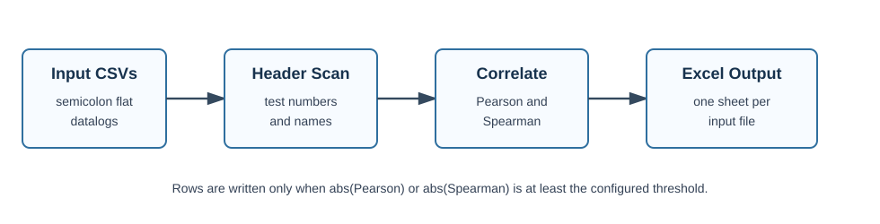
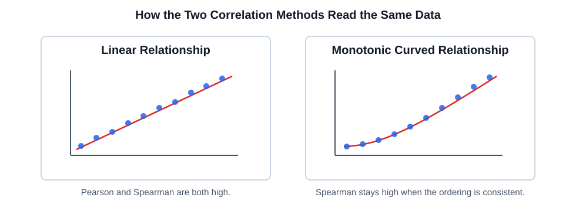
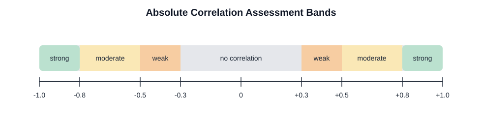

# Test Data Correlation

This folder contains a standalone correlation utility for flat IG-XL style CSV datalogs. It scans each input file, extracts the numeric test columns, calculates Pearson and Spearman correlations between each test and the remaining tests, then writes one Excel worksheet per input file.



## Quick Start

From this folder, run:

```powershell
c:/UserData/Learning/Software_Programming/GitHub_Nelio92/.venv/Scripts/python.exe test_data_correlation.py
```

By default the script reads every `*.csv` in this folder and writes:

```text
Outputs/Test_Data_Correlation_Report.xlsx
```

The default input folder is also exposed near the top of `test_data_correlation.py`:

```python
SCRIPT_FOLDER = Path(__file__).resolve().parent
INPUT_FOLDER = SCRIPT_FOLDER
OUTPUT_FILE: Path | None = None
```

Edit `INPUT_FOLDER` if you want a fixed folder in the code, or pass `--input-folder` when running the script.

The correlation threshold is an input parameter:

```powershell
c:/UserData/Learning/Software_Programming/GitHub_Nelio92/.venv/Scripts/python.exe test_data_correlation.py --threshold 0.8
```

Useful optional arguments:

```powershell
c:/UserData/Learning/Software_Programming/GitHub_Nelio92/.venv/Scripts/python.exe test_data_correlation.py --single-file 20260430101828_3FT60R22_003_S11E_N_LNZUF01-WIN10_CTRX8144.csv
c:/UserData/Learning/Software_Programming/GitHub_Nelio92/.venv/Scripts/python.exe test_data_correlation.py --input-folder C:/path/to/csvs --output-file C:/path/to/report.xlsx
c:/UserData/Learning/Software_Programming/GitHub_Nelio92/.venv/Scripts/python.exe test_data_correlation.py --threshold 0.9 --min-paired-values 5
```

## Input Format

The parser follows the same flat CSV assumptions used by `Test_Data_Reviewer`:

1. The first row contains metadata fields and digit-only test-number columns.
2. The `Test Name` metadata row maps test numbers to human-readable names.
3. Optional rows such as `Low`, `High`, `Unit`, `Min`, and `Max` may follow.
4. Device rows start at the first row whose first cell is numeric.
5. The file is semicolon-separated and supports comma decimal values.

Only digit-only header columns are treated as tests. Metadata fields such as `LOT`, `WAFER`, `X`, `Y`, `SITE_NUM`, and binning fields are not correlated.

## Calculations

For each file, the script builds the numeric measurement table and drops tests that cannot produce a stable correlation:

- fewer than `--min-paired-values` numeric measurements
- constant columns with fewer than two distinct numeric values

It then calculates two correlation matrices:

- `Corr_Pearson`: linear correlation on the measured values
- `Corr_Spearmann`: rank-based monotonic correlation using Spearman calculation

The R-squared fields are calculated as:

```text
Rsquared_Pearson = Corr_Pearson ^ 2
Rsquared_Spearmann = Corr_Spearmann ^ 2
```

A pair is written when either absolute correlation value is greater than or equal to the configured threshold. The default threshold is `0.8`.



## Output Columns

Each workbook sheet uses this column order:

| Column | Meaning |
| --- | --- |
| `Test Number 1` | First test number from the CSV header |
| `Test Name 1` | First test name from the `Test Name` row |
| `Corr_Pearson` | Pearson correlation between the two tests |
| `Corr_Spearmann` | Spearman rank correlation between the two tests |
| `Rsquared_Pearson` | Squared Pearson correlation |
| `Rsquared_Spearmann` | Squared Spearman correlation |
| `Test Number 2` | Second test number from the CSV header |
| `Test Name 2` | Second test name from the `Test Name` row |
| `Assessment` | Heuristic strength label |

Excel filters are enabled automatically on every sheet, the top row is frozen, and column widths are fitted after data is written. This makes it possible to open the workbook and immediately filter by a particular test number or test name.

While the script runs, the terminal shows percentage progress for the current workbook file count and for the Excel row-writing phase of each file.

## Assessment Heuristic

The assessment uses the strongest absolute value from Pearson and Spearman:



| Strongest absolute correlation | Assessment |
| --- | --- |
| `>= 0.8` | `strong correlation` |
| `>= 0.5` and `< 0.8` | `moderate correlation` |
| `>= 0.3` and `< 0.5` | `weak correlation` |
| `< 0.3` or unavailable | `no correlation` |

With the default threshold of `0.8`, written rows will normally have `strong correlation`. The other labels become useful if you lower `--threshold` for exploratory runs.

## Notes and Limits

- Each pair is written once, so `Test A` vs `Test B` is not duplicated as `Test B` vs `Test A`.
- Blank, non-numeric, infinite, or unparseable values are ignored by the correlation calculations.
- Constant tests are skipped because correlation is undefined when one side has no variation.
- If a workbook is open and cannot be overwritten, the script saves a timestamped copy next to the requested output file.
- If a sheet would exceed the configured row limit, the strongest pairs are written first and the sheet is truncated at that limit.
